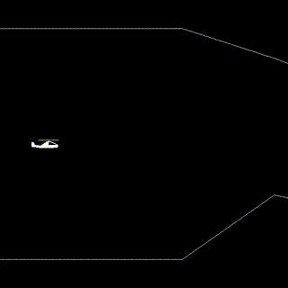

# rusty-navigator
Fly a helicopter through a 2D cave.



## Build & Run
Have [Rust](https://www.rust-lang.org/tools/install) installed.

```bash
cargo run
```

## Controls
Fly up: Spacebar or Up arrow
Toggle pause: P
Restart: R
Quit: Escape
